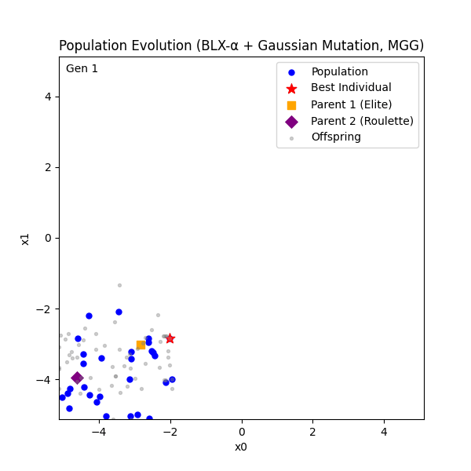

# 遺伝的アルゴリズム(GA)を利用したRastrigin関数の最小値探索

---

## 1. 概要



本プロジェクトは、

* **MGG（Minimal Generation Gap）**
* **BLX-α交叉（Blend Crossover, α=0.5）**
* **突然変異（Gaussian Mutation）**

を組み合わせた遺伝的アルゴリズム（GA）で、多峰性最適化問題である **Rastrigin関数** の最小値探索を行う。

---

## 2. 実行環境

* Python 3.9+
* 必要ライブラリ

  ```bash
  pip install numpy matplotlib
  ```

---

## 3. 評価関数（Rastrigin関数）
**Rastrigin関数:**


**定義:**

$$
f(\mathbf{x}) = A n + \sum_{i=1}^n \left( x_i^2 - A \cos( 2 \pi x_i ) \right)
$$

* $A = 10$
* 最小値 $f(\mathbf{0}) = 0$

**特徴:**

* 多峰性 → 局所解が多数存在
* グローバル最適化手法（GAなど）の性能評価に向く

---

## 4. 理論

### 4.1 遺伝的アルゴリズム（GA）の流れ

1. **初期集団生成**
2. **適応度計算**
3. **親選択**
4. **交叉（BLX-α）**
5. **突然変異**
6. **世代交代（MGG）**
7. **収束判定**

---

### 4.2 BLX-α交叉（Blend Crossover）

親の $i$ 番目の遺伝子 $x_{1i}, x_{2i}$ から子個体を作る。

**範囲計算式:**

$$
L_i = \min(x_{1i}, x_{2i}) - \alpha |x_{1i} - x_{2i}|
$$

$$
U_i = \max(x_{1i}, x_{2i}) + \alpha |x_{1i} - x_{2i}|
$$

$$
c_i \sim \mathcal{U}[L_i, U_i]
$$

* α が大きい → 探索範囲広く（探索重視）
* α が小さい → 親の近くに収束（局所探索）

**実装対応箇所**

```python
def blx_alpha_crossover(p1, p2, cfg):
    alpha = cfg.blx_alpha
    child = []
    for i in range(cfg.dim):
        cmin, cmax = min(p1[i], p2[i]), max(p1[i], p2[i])
        I = cmax - cmin
        low  = cmin - alpha * I
        high = cmax + alpha * I
        val = random.uniform(low, high)
        child.append(clamp(val, cfg.lower_bound, cfg.upper_bound))
    return child
```

---

### 4.3 突然変異（Gaussian Mutation）

子個体の各遺伝子 $x_i$ に対し、確率 $p_{mut}$ で正規分布 $N(0, \sigma^2)$ に従うノイズを加える。

$$
x'_i = \mathrm{clip}(x_i + \mathcal{N}(0, \sigma^2), \text{lower}, \text{upper})
$$

* **探索範囲の拡張**: 交叉で得られない解に飛べる
* **多様性維持**: 収束の早すぎ防止

**実装対応箇所**

```python
def mutate(ind, cfg):
    for i in range(cfg.dim):
        if random.random() < cfg.mutation_rate:
            ind[i] += random.gauss(0, cfg.mutation_std)
            ind[i] = clamp(ind[i], cfg.lower_bound, cfg.upper_bound)
    return ind
```

---

### 4.4 MGG（Minimal Generation Gap）

**目的:** 集団全体を更新せず、一部だけ置き換え多様性を維持。

手順:

1. 親1 = エリート選択（集団内最良）
2. 親2 = ルーレット選択
3. BLX-α + 突然変異で子個体多数生成
4. 親+子から最良2体選抜
5. 集団内の2個体を置き換え

**実装対応箇所**

```python
elite_i = min(range(len(pop)), key=lambda i: fitness[i])
elite = pop[elite_i][:]
roulette = roulette_select(pop, fitness)

offspring = [mutate(blx_alpha_crossover(elite, roulette, cfg), cfg)
             for _ in range(cfg.offspring_per_gen)]

candidates = offspring + [elite, roulette]
cand_fit = [objective(ind) for ind in candidates]
best2_idx = sorted(range(len(candidates)), key=lambda i: cand_fit[i])[:2]

pop[elite_i] = candidates[best2_idx][:]
pop[(elite_i + 1) % cfg.pop_size] = candidates[best2_idx[1]][:]
```

---

## 5.文法

### Clamp関数
ある値が指定した範囲に収まるように制限するための関数。もし値が範囲内ならば、そのまま値を返し、範囲外であれば最も近い境界値に固定する。clamp関数は通常3つの引数をとる。
- value : 制限したい元の値
- min_value : 許容される最小値
- max_value : 許容される最大値
#### 実装例
``` python
def clamp(x: float, lo: float, hi: float) -> float:
    """探索範囲を超えた場合に、範囲の端に制限（致死個体を防ぐ有効解修復）"""
    return max(lo, min(hi, x))
```

---