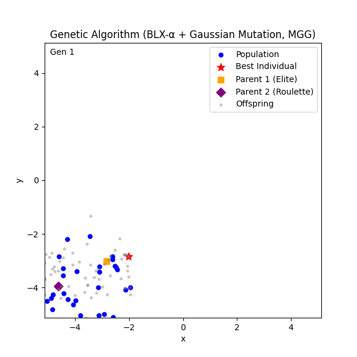
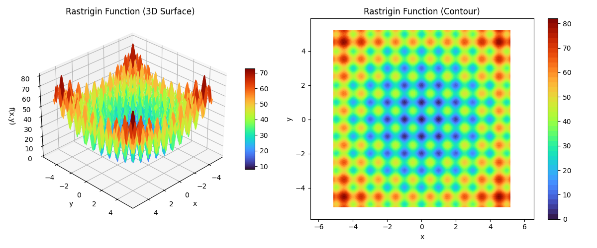

# 遺伝的アルゴリズム(GA)を利用したRastrigin関数の最小値探索

---

## 1. 概要



本プロジェクトは、

* **MGG（Minimal Generation Gap）**
* **BLX-α交叉（Blend Crossover, α=0.5）**
* **突然変異（Gaussian Mutation）**

を組み合わせた遺伝的アルゴリズム（GA）で、多峰性最適化問題である **Rastrigin関数** の最小値探索を行う。

---

## 2. 実行環境

* Python 3.9+
* 必要ライブラリ

  ```bash
  pip install numpy matplotlib
  ```

---

## 3. 評価関数（Rastrigin関数）
**Rastrigin関数:**



**定義:**

$$
f(\mathbf{x}) = A n + \sum_{i=1}^n \left( x_i^2 - A \cos( 2 \pi x_i ) \right)
$$

* $A = 10$
* 最小値 $f(\mathbf{0}) = 0$

**特徴:**

* 多峰性 → 局所解が多数存在
* グローバル最適化手法（GAなど）の性能評価に向く

---

## 4. 理論

### 4.1 遺伝的アルゴリズム（GA）の流れ

1. **初期集団生成**
2. **適応度計算**
3. **親選択**
4. **交叉（BLX-α）**
5. **突然変異**
6. **世代交代（MGG）**
7. **収束判定**

---

### 4.2 BLX-α交叉（Blend Crossover）

親の $i$ 番目の遺伝子 $x_{1i}, x_{2i}$ から子個体を作る。

**範囲計算式:**

$$
L_i = \min(x_{1i}, x_{2i}) - \alpha |x_{1i} - x_{2i}|
$$

$$
U_i = \max(x_{1i}, x_{2i}) + \alpha |x_{1i} - x_{2i}|
$$

$$
c_i \sim \mathcal{U}[L_i, U_i]
$$

* α が大きい → 探索範囲広く（探索重視）
* α が小さい → 親の近くに収束（局所探索）

**実装対応箇所**

```python
def blx_alpha_crossover(p1, p2, cfg):
    alpha = cfg.blx_alpha
    child = []
    for i in range(cfg.dim):
        cmin, cmax = min(p1[i], p2[i]), max(p1[i], p2[i])
        I = cmax - cmin
        low  = cmin - alpha * I
        high = cmax + alpha * I
        val = random.uniform(low, high)
        child.append(clamp(val, cfg.lower_bound, cfg.upper_bound))
    return child
```

---

### 4.3 突然変異（Gaussian Mutation）

子個体の各遺伝子 $x_i$ に対し、確率 $p_{mut}$ で正規分布 $N(0, \sigma^2)$ に従うノイズを加える。

$$
x'_i = \mathrm{clip}(x_i + \mathcal{N}(0, \sigma^2), \text{lower}, \text{upper})
$$

* **探索範囲の拡張**: 交叉で得られない解に飛べる
* **多様性維持**: 収束の早すぎ防止

**実装対応箇所**

```python
def mutate(ind, cfg):
    for i in range(cfg.dim):
        if random.random() < cfg.mutation_rate:
            ind[i] += random.gauss(0, cfg.mutation_std)
            ind[i] = clamp(ind[i], cfg.lower_bound, cfg.upper_bound)
    return ind
```

---

### 4.4 MGG（Minimal Generation Gap）

**目的:** 集団全体を更新せず、一部だけ置き換え多様性を維持。

手順:

1. 親1 = エリート選択（集団内最良）
2. 親2 = ルーレット選択
3. BLX-α + 突然変異で子個体多数生成
4. 親+子から最良2体選抜
5. 集団内の2個体を置き換え

**実装対応箇所**

```python
elite_i = min(range(len(pop)), key=lambda i: fitness[i])
elite = pop[elite_i][:]
roulette = roulette_select(pop, fitness)

offspring = [mutate(blx_alpha_crossover(elite, roulette, cfg), cfg)
             for _ in range(cfg.offspring_per_gen)]

candidates = offspring + [elite, roulette]
cand_fit = [objective(ind) for ind in candidates]
best2_idx = sorted(range(len(candidates)), key=lambda i: cand_fit[i])[:2]

pop[elite_i] = candidates[best2_idx][:]
pop[(elite_i + 1) % cfg.pop_size] = candidates[best2_idx[1]][:]
```

---

## 5. 実装コード全文

```python
# ==========================================================
# MGG + BLX-α + 突然変異 GA 実装
# ==========================================================
import math, random
from dataclasses import dataclass
from typing import List, Callable, Optional, Dict, Any
from pathlib import Path
import numpy as np
import matplotlib
matplotlib.use("Agg")
import matplotlib.pyplot as plt
from matplotlib.animation import PillowWriter, FuncAnimation

# ---------- 評価関数 ----------
def rastrigin(x: List[float]) -> float:
    A = 10.0
    n = len(x)
    return A * n + sum((xi**2 - A * math.cos(2 * math.pi * xi)) for xi in x)

# ---------- GA設定 ----------
@dataclass
class GAConfig:
    dim: int = 2
    lower_bound: float = -5.12
    upper_bound: float = 5.12
    init_low: float = -5.12
    init_high: float = -2.0
    pop_size: int = 30
    max_generations: int = 100
    offspring_per_gen: int = 60
    blx_alpha: float = 0.5
    mutation_rate: float = 0.1
    mutation_std: float = 0.1
    random_seed: Optional[int] = 42
    log_interval: int = 10

# ---------- 基本関数 ----------
def clamp(x: float, lo: float, hi: float) -> float:
    return max(lo, min(hi, x))

def init_individual(cfg: GAConfig) -> List[float]:
    return [random.uniform(cfg.init_low, cfg.init_high) for _ in range(cfg.dim)]

def init_population(cfg: GAConfig) -> List[List[float]]:
    return [init_individual(cfg) for _ in range(cfg.pop_size)]

def evaluate_population(pop: List[List[float]], obj: Callable) -> List[float]:
    return [obj(ind) for ind in pop]

def roulette_select(pop: List[List[float]], fitness: List[float]) -> List[float]:
    fmax = max(fitness)
    scores = [fmax - f for f in fitness]
    ssum = sum(scores)
    if ssum <= 0:
        return pop[random.randrange(len(pop))][:]
    r, acc = random.random() * ssum, 0.0
    for ind, s in zip(pop, scores):
        acc += s
        if acc >= r:
            return ind[:]
    return pop[-1][:]

def blx_alpha_crossover(p1: List[float], p2: List[float], cfg: GAConfig) -> List[float]:
    alpha, lb, ub = cfg.blx_alpha, cfg.lower_bound, cfg.upper_bound
    child = []
    for i in range(cfg.dim):
        cmin, cmax = min(p1[i], p2[i]), max(p1[i], p2[i])
        I = cmax - cmin
        low, high = cmin - alpha * I, cmax + alpha * I
        val = random.uniform(low, high)
        child.append(clamp(val, lb, ub))
    return child

def mutate(ind: List[float], cfg: GAConfig) -> List[float]:
    for i in range(cfg.dim):
        if random.random() < cfg.mutation_rate:
            ind[i] += random.gauss(0, cfg.mutation_std)
            ind[i] = clamp(ind[i], cfg.lower_bound, cfg.upper_bound)
    return ind

# ---------- GA本体 ----------
def run_ga_mgg(objective: Callable[[List[float]], float], cfg: GAConfig):
    if cfg.random_seed is not None:
        random.seed(cfg.random_seed)
    pop = init_population(cfg)
    fitness = evaluate_population(pop, objective)

    best_idx = min(range(len(pop)), key=lambda i: fitness[i])
    best_ind, best_fit, best_gen = pop[best_idx][:], fitness[best_idx], 0

    snaps = []
    for gen in range(1, cfg.max_generations + 1):
        elite_i = min(range(len(pop)), key=lambda i: fitness[i])
        elite = pop[elite_i][:]
        roulette = roulette_select(pop, fitness)

        offspring = [
            mutate(blx_alpha_crossover(elite, roulette, cfg), cfg)
            for _ in range(cfg.offspring_per_gen)
        ]
        candidates = offspring + [elite, roulette]
        cand_fit = [objective(ind) for ind in candidates]
        best2_idx = sorted(range(len(candidates)), key=lambda i: cand_fit[i])[:2]
        pop[elite_i] = candidates[best2_idx[0]][:]
        pop[(elite_i + 1) % cfg.pop_size] = candidates[best2_idx[1]][:]
        fitness = evaluate_population(pop, objective)

        curr_best_i = min(range(len(pop)), key=lambda i: fitness[i])
        if fitness[curr_best_i] < best_fit:
            best_fit, best_ind, best_gen = fitness[curr_best_i], pop[curr_best_i][:], gen

        snaps.append({
            "gen": gen,
            "pop": np.array(pop),
            "best": np.array(best_ind),
            "parents": np.array([elite, roulette]),
            "offspring": np.array(offspring)
        })

        if gen % cfg.log_interval == 0 or gen == 1:
            print(f"[Gen {gen}] best={best_fit:.6f} found@{best_gen}")

    return best_ind, best_fit, best_gen, snaps

# ---------- アニメーション ----------
def make_animation(snaps, cfg: GAConfig, path: Path):
    lb, ub = cfg.lower_bound, cfg.upper_bound
    fig, ax = plt.subplots(figsize=(6, 6))
    ax.set_xlim(lb, ub)
    ax.set_ylim(lb, ub)
    ax.set_xlabel("x0")
    ax.set_ylabel("x1")
    ax.set_title("Population Evolution")
    scat_pop = ax.scatter([], [], s=25, color="blue", label="Population")
    scat_best = ax.scatter([], [], s=90, marker="*", color="red", label="Best")
    scat_p1 = ax.scatter([], [], s=60, marker="s", color="orange", label="Parent 1")
    scat_p2 = ax.scatter([], [], s=60, marker="D", color="purple", label="Parent 2")
    scat_off = ax.scatter([], [], s=8, alpha=0.35, color="gray", label="Offspring")
    txt = ax.text(0.02, 0.98, "", transform=ax.transAxes, va="top")
    ax.legend(loc="upper right")

    def init():
        empty = np.empty((0, 2))
        scat_pop.set_offsets(empty)
        scat_best.set_offsets(empty)
        scat_p1.set_offsets(empty)
        scat_p2.set_offsets(empty)
        scat_off.set_offsets(empty)
        txt.set_text("")
        return scat_pop, scat_best, scat_p1, scat_p2, scat_off, txt

    def update(frame_idx: int):
        snap = snaps[frame_idx]
        scat_pop.set_offsets(snap["pop"])
        scat_best.set_offsets(snap["best"].reshape(1, 2))
        scat_p1.set_offsets(snap["parents"][0].reshape(1, 2))
        scat_p2.set_offsets(snap["parents"][1].reshape(1, 2))
        scat_off.set_offsets(snap["offspring"])
        txt.set_text(f"Gen {snap['gen']}")
        return scat_pop, scat_best, scat_p1, scat_p2, scat_off, txt

    anim = FuncAnimation(fig, update, frames=len(snaps), init_func=init, blit=False, interval=200)
    writer = PillowWriter(fps=5)
    anim.save(str(path), writer=writer)
    plt.close(fig)
    return path

# ---------- 実行 ----------
if __name__ == "__main__":
    cfg = GAConfig()
    gif_path = Path(__file__).parent.parent / "assets" / "GA_result.gif"
    best_x, best_f, best_gen, snaps = run_ga_mgg(rastrigin, cfg)
    gif_file = make_animation(snaps, cfg, gif_path)
    print("\n=== 結果 ===")
    print(f"最良適応度 : {best_f:.6f}")
    print(f"発見世代   : {best_gen}")
    print(f"最良解     : {best_x}")
    print(f"GIF保存先  : {gif_file}")
```

---